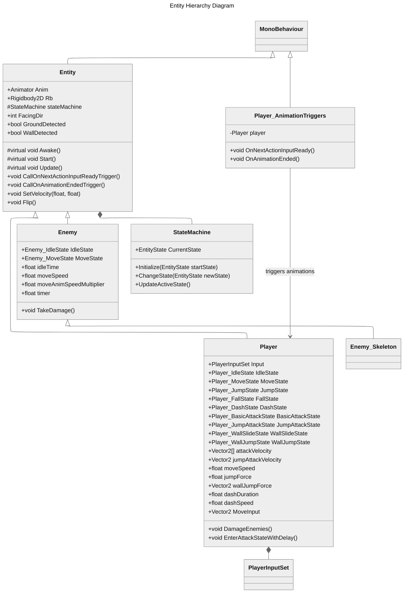
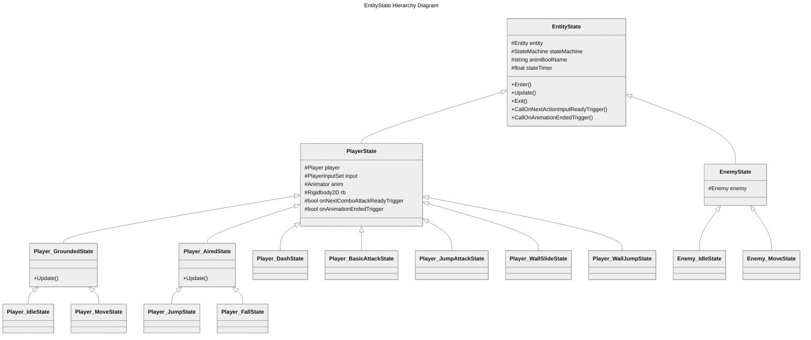

# Unity2DRPG
Unity 2D RPG (Role Playing) Game.


# Environment Setup

Unity version: **6000.1.2f1** - May 6, 2025  

https://unity.com/releases/editor/archive  


# VS Code Preferences

Enable Setting 'Format On Save' - The current file will be formatted when you press CMD+S.

Open Settings, search for "exclude", under "Files: Exclude", click on **Add Pattern**. Type
`**/bin` and click **OK**. And do the same for `**/obj`. This will hide these folders from the
Solution Explorer, since we won't interact with them very often.

Within Settings, search for "bracket" and make sure these two settings are Enabled:
- Auto Closing Brackets - Always
- Bracket Pair Colorization: Enabled - Checked
- Bracket Pair Colorization: Independent Color Pool Per Bracket Type - Unchecked
- Guides: Bracket Pairs - True

Open the **Command Palette** with: `SHIFT + CMD + P` (MacOS).

Open the editor's **More Actions...** contextual menu with `CMD + .` (MacOS); this will provide 
you with helpful quick actions like "Remove unnecessary usings", or "Generate constructor".

Open the **Keyboard Shortcuts** window under Settings, then click on the small icon in the
top-right corner with tooltip "Open Keyboard Shortcuts (JSON)" (the icon looks like a piece
of paper with a folded corner, and a circular arrow on the left). In the `keybindings.json`
file, add this entry:

```json
{
    "key": "shift shift",
    "command": "workbench.action.quickOpen"
}
```

Save the `keybindings.json` file and then close it. Now, when you double-tap SHIFT, it will open
up a sort of "Global Object Search" form field, and you can type the name of an entity, like
our `AppUser.cs`, and then press RETURN to open the file. Super-handy to have!

More details:
https://stackoverflow.com/questions/29613191/intellij-shift-shift-shortcut-in-visual-studio-global-search  

Under **Settings > CodeLens**, turn off "Show Main Code Lens". It adds extraneous noise to every 
method signature in the editor UI, with a bunch of "N references" indicators everywhere.


# Unity Tips & Tricks

## General
* Unity 6 Engine Lifecycle Execution Order: https://docs.unity3d.com/6000.0/Documentation/Manual/execution-order.html
* The Unity documentation can be found [here](https://docs.unity3d.com/Manual/index.html) 
  and the scripting reference can be found [here](https://docs.unity3d.com/ScriptReference/index.html)
* You can modify the template used by Unity when creating new scripts by editing 
  `Unity\Editor\Data\Resources\ScriptTemplates\81-C# Script-NewBehaviourScript.cs.txt`. 
  You can add a header, tidy up the using statements, setup tabs to your liking, add regions etc.
* When creating a new Unity project make sure to select `2D` or `3D` depending on what 
  type of project you are working on
* C# is probably the best choice of language for Unity. The vast majority of resources 
  available use C# e.g. documentation, tutorials, YouTube videos

## User Interface
* To reset all the editor views back to default you can click `Window -> Layouts -> Default`
* You can drag windows to different locations by left clicking and holding the title bar 
  and dragging it to where you want it
* When playing the game in Unity any changes you make in the editor will not be persisted. 
  To make that obvious you can change the UI tint used when playing with `Edit -> Preferences -> Colors -> Playmode tint`
* The five buttons on the top left of the main window are (with keyboard shortcuts):
  * Pan scene (`Q`)
  * Move objects (`W`)
  * Rotate objects (`E`)
  * Scale objects (`R`)
  * Rect tool used for UI tranforms (`T`)
* The five buttons on the top left of the `Scene` window are:
  * Render mode
  * 3D or 2D mode
  * Lighting on or off
  * Audio on or off
  * Effects on or off
* In 3D mode you can use the `mouse wheel` to zoom in and out, hold the `middle mouse button` 
  to pan and hold the `right mouse button` to look around. In 2D mode it is the same except 
  `right mouse button` also pans
* To zoom in/out on a specific object, double click it in the `Hierarchy` window
* You can drag and drop files in to Unity
* Get a larger view when playing the game in Unity by clicking the `Game` window 
  and enabling `Maximize On Play`
* You can use the mouse to increase and decrease numeric values in the `Inspector` 
  window by holding down the left mouse button on the label and moving the mouse
* You can see how your game will look in different resolutions by clicking the second 
  dropdown on the top of the `Game` window and selecting a resolution

## Keyboard Shortcuts
* Other useful keyboard shortcuts are:
  * `Ctrl + P` to play or stop

## Engine
* Some of the more important event functions are (full details can be found [here](https://docs.unity3d.com/Manual/ExecutionOrder.html)):
  * `Awake` is called on each object when the scene starts and before any Start functions are called
  * `Start` is called once only on each object before the first frame update
  * `Update` is called on each object every frame
* You can change the background color when playing by selecting the camera and changing 
  the `Background` property in the `Inspector` window

## Git
* To turn off the `LF will be replaced by CRLF` warnings in Windows execute the following 
  in a command prompt: `git config --global core.safecrlf false`

## Prefabs
* You can use prefabs to make it easier to work with multiples of the same object that share some or all of the same properties
* To do this you must first have the base object in the scene, so either create it as required or drag it from the `Assets` window
* Drag the object from the `Hierarchy` window to a `Prefabs` folder in the `Assets` window
* It will turn a blue color in the `Hierarchy` window to indicate it is a prefab
* You can now delete it from the `Hierarchy` window if needed
* Click the prefab in the `Assets` window and make whatever changes you need e.g. rename it, set some base properties
* Now drag the prefab as many times as you need in to the scene
* Any settings that differ for the object in the scene from the prefab will be shown in bold in the `Inspector` window
* You can revert an object in the scene back to the prefab defaults by clicking `Prefab -> Revert` in the `Inspector` window


# Screenshots

| Sprite Sheet Editor - Grid By Cell Size |
| :---: |
|  |

| Animator UI - Exit Time & Transition |
| :---: |
|  |


# Architecture Overview

The Bravery RPG project implements a sophisticated State Machine pattern for both player and enemy control:

## Core Architecture

1. **Entity** is the base class for all game actors and:
   - Inherits from MonoBehaviour
   - Contains common properties like Animator, RigidBody2D
   - Handles collision detection, flipping sprites, and velocity setting
   - Contains a StateMachine reference

2. **StateMachine** manages state transitions and tracks the current state for any Entity.

3. **EntityState** is the abstract base class for all states with standard lifecycle methods:
   - Enter: Called when entering a state
   - Update: Called every frame while in a state 
   - Exit: Called when leaving a state

## Player Architecture

1. **Player** extends Entity with:
   - Input handling via PlayerInputSet
   - Multiple state instances for different player behaviors
   - Combat mechanics like attack velocity and damage dealing
   - Movement parameters like speed, jump force, and dash duration

2. Player States are organized in a hierarchy:
   - **PlayerState** (base for all player states)
     - **Player_GroundedState** (base for states when player is on ground)
       - Player_IdleState
       - Player_MoveState
     - **Player_AiredState** (base for states when player is in air)
       - Player_JumpState
       - Player_FallState
     - Player_DashState
     - Player_BasicAttackState
     - Player_JumpAttackState
     - Player_WallSlideState
     - Player_WallJumpState

3. **Player_AnimationTriggers** allows animation events to trigger player state changes.

## Enemy Architecture

1. **Enemy** extends Entity with:
   - Basic damage handling
   - Movement parameters and idle time configuration
   - Visual feedback (color change when damaged)

2. **Enemy_Skeleton** extends Enemy for specific enemy type implementation.

3. Enemy States:
   - **EnemyState** (base for all enemy states)
     - Enemy_IdleState
     - Enemy_MoveState

This architecture allows for:
- Clean separation between different behaviors through the state pattern
- Code reuse through inheritance hierarchies
- Easy addition of new states and behaviors
- Clear distinction between player and enemy behaviors


# Diagrams

## Class Hierarchy for Bravery RPG

### Entity Hierarchy Diagram




### EntityState Hierarchy Diagram




# Unit Testing Framework

This project uses Unity's built-in Test Framework (based on NUnit) to ensure code quality and reliability, particularly for complex calculation systems like `Entity_Stats`. Unit tests help catch bugs early, document expected behavior, and make refactoring safer.

## Test Framework Architecture

### Unity Test Framework Overview
Unity's Test Framework provides two types of tests:
- **Edit Mode Tests** - Run in the Unity Editor without entering Play Mode. Perfect for testing pure logic, calculations, and non-MonoBehaviour classes.
- **Play Mode Tests** - Run during Play Mode and can test GameObject interactions, physics, and scene-based functionality.

For our stat calculations in `Entity_Stats`, we use Edit Mode tests since they're faster and don't require scene setup.

### Test Assembly Structure
```
Assets/Scripts/
├── Tests.asmdef                    # Test assembly definition
├── Entity_StatsTests.cs           # Unit tests for Entity_Stats component
└── Editor/
    └── TestRunnerUtility.cs       # Helper utilities for running tests
```

The `Tests.asmdef` file configures the test assembly with:
- NUnit framework references
- Unity Test Runner integration  
- Editor-only execution constraints

## Running Tests

### From VS Code (Recommended)
1. **Open Command Palette** (`Cmd+Shift+P`)
2. **Select "Tasks: Run Task"**
3. **Choose from available test tasks:**
   - `Unity: Run All Tests` - Runs all tests in batch mode
   - `Unity: Run Entity Stats Tests` - Runs only Entity_Stats tests
   - `Unity: Run Tests (Interactive)` - Opens Unity Editor for interactive testing
   - `Unity: View Test Results` - Displays latest test results

### From Unity Editor
1. **Open Test Runner Window:** `Window > General > Test Runner`
2. **Switch to EditMode tab**
3. **Click "Run All" or select specific tests**
4. **View results in real-time**

### From Unity Menu (Custom Utilities)
- `Tools > Testing > Run All Tests`
- `Tools > Testing > Run Edit Mode Tests`  
- `Tools > Testing > Run Entity Stats Tests`
- `Tools > Testing > Open Test Runner Window`

### Command Line (CI/CD)
```bash
# Run all tests in batch mode
/Applications/Unity/Hub/Editor/2022.3.50f1/Unity.app/Contents/MacOS/Unity \
  -batchmode -quit \
  -projectPath ./BraveryRPG \
  -runTests \
  -testPlatform EditMode \
  -testResults ./TestResults.xml
```

## Test Coverage

### Entity_Stats Test Suite
The `Entity_StatsTests` class provides comprehensive coverage for all stat calculation methods:

#### Physical Damage Tests
- ✅ Base damage calculation
- ✅ Strength bonus integration  
- ✅ Critical hit mechanics
- ✅ Critical power from strength
- ✅ Critical chance from agility
- ✅ Complex multi-stat interactions

#### Elemental Damage Tests
- ✅ No elemental damage scenarios
- ✅ Single element type calculation
- ✅ Multi-element with highest selection
- ✅ Minor bonus damage from weaker elements
- ✅ Intelligence bonus integration
- ✅ Tied element value handling

#### Elemental Resistance Tests
- ✅ Base resistance calculation
- ✅ Intelligence bonus resistance
- ✅ 75% resistance cap enforcement
- ✅ None element type handling

#### Armor Mitigation Tests
- ✅ Base armor mitigation formula
- ✅ Vitality bonus armor
- ✅ Armor reduction debuff application
- ✅ 85% mitigation cap enforcement
- ✅ 100% armor reduction edge case

#### Health & Evasion Tests
- ✅ Max health with vitality bonuses
- ✅ Evasion with agility bonuses
- ✅ Evasion cap enforcement

#### Armor Penetration Tests
- ✅ Percentage to fraction conversion
- ✅ Zero and high penetration values

### Test Methodology
Each test follows the **Arrange-Act-Assert** pattern:

```csharp
[Test]
public void GetPhysicalDamage_WithStrengthBonus_IncludesBonusDamage()
{
    // Arrange - Set up test conditions
    SetStatValue(entityStats.offense.damage, 50f);
    SetStatValue(entityStats.major.strength, 20f);
    
    // Act - Execute the method under test
    float damage = entityStats.GetPhysicalDamage(out bool isCrit);
    
    // Assert - Verify expected results
    Assert.AreEqual(70f, damage, 0.01f, "Should include strength bonus");
    Assert.IsFalse(isCrit, "Should not crit with 0% chance");
}
```

## Test Results and Debugging

### Interpreting Test Results
- **Green checkmarks** - Tests passed successfully
- **Red X marks** - Tests failed with assertion errors
- **Yellow warnings** - Tests passed but with warnings

### Common Test Failures
1. **Assertion Failures** - Expected vs actual value mismatches
2. **NullReferenceException** - Missing component initialization
3. **Precision Errors** - Float comparison issues (use delta values)

### Debugging Failed Tests
1. **Read the assertion message** - Often contains specific failure details
2. **Check test setup** - Ensure all required components are initialized
3. **Verify calculation logic** - Compare expected vs actual formulas
4. **Use Debug.Log** - Add logging to understand intermediate values

### Test Output Files
- `TestResults.xml` - Detailed test results in XML format
- `unity-test.log` - Unity console output during test execution
- `entity-stats-test.log` - Specific Entity_Stats test output

## Best Practices

### Writing New Tests
1. **One concept per test** - Each test should verify a single behavior
2. **Descriptive test names** - Use format: `Method_Scenario_ExpectedBehavior`
3. **Clear arrange/act/assert sections** - Separate test phases with comments
4. **Use meaningful assertions** - Include descriptive failure messages
5. **Test edge cases** - Zero values, caps, negative inputs, etc.

### Test Maintenance
- **Update tests when changing formulas** - Keep tests synchronized with code
- **Add tests for new features** - Maintain test coverage as code grows
- **Refactor test helpers** - Extract common setup into helper methods
- **Review test failures immediately** - Don't let broken tests accumulate

### Performance Considerations
- **Edit Mode tests are fast** - They don't require scene loading
- **Avoid complex GameObject setup** - Use minimal test fixtures
- **Cache test data** - Reuse test objects when possible
- **Run specific test suites** - Use filters to run only relevant tests

## Integration with Development Workflow

### Pre-commit Testing
Run Entity_Stats tests before committing changes to stat calculations:
```bash
# Quick test command for pre-commit hooks
/Applications/Unity/Hub/Editor/2022.3.50f1/Unity.app/Contents/MacOS/Unity \
  -batchmode -quit -projectPath ./BraveryRPG \
  -runTests -testPlatform EditMode -testFilter "Entity_StatsTests"
```

### Continuous Integration
The test framework supports automated testing in CI/CD pipelines:
- Tests run in headless mode (no GUI required)
- XML results can be parsed by CI systems
- Exit codes indicate test success/failure

### VS Code Integration
The workspace is configured with tasks for seamless testing:
- `Cmd+Shift+P` → "Tasks: Run Task" → Select test task
- Results appear in VS Code terminal
- Failed tests show detailed error messages

## Troubleshooting

### Common Issues
1. **"Assembly not found" errors** - Ensure Tests.asmdef is properly configured
2. **"Unity not found" errors** - Update Unity path in tasks.json
3. **"Test runner not responding"** - Close Unity Editor and retry
4. **Permission errors** - Check file system permissions for test output

### Unity Version Compatibility
This test framework is configured for Unity 2022.3.50f1. For other versions:
1. Update Unity path in `.vscode/tasks.json`
2. Verify NUnit version compatibility
3. Check Test Framework package version

### Getting Help
- Unity Test Framework Documentation: https://docs.unity3d.com/Packages/com.unity.test-framework@latest
- NUnit Documentation: https://docs.nunit.org/
- Unity Forums: https://forum.unity.com/forums/scripting.12/
