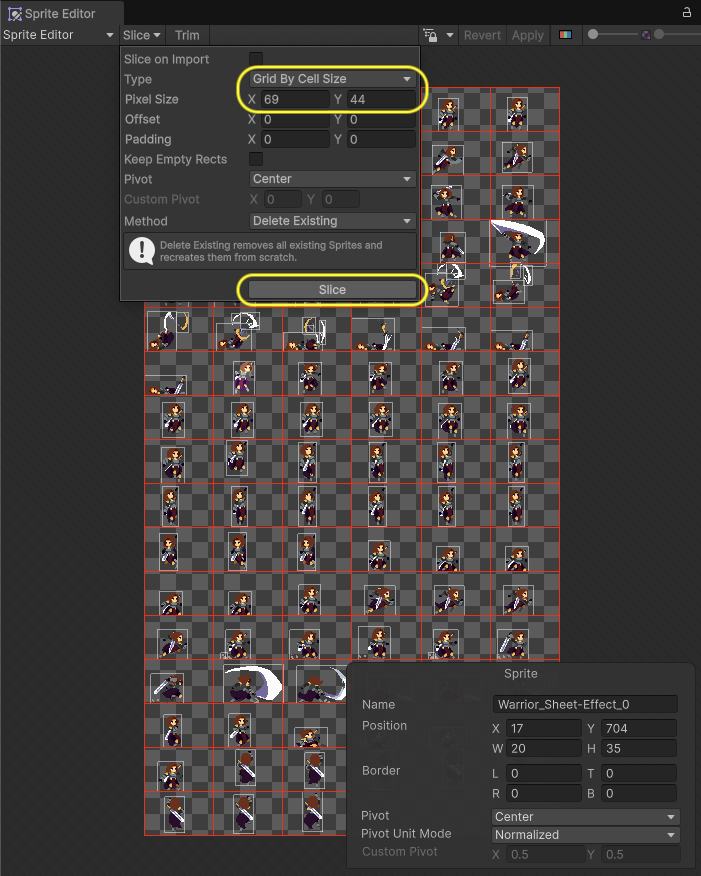
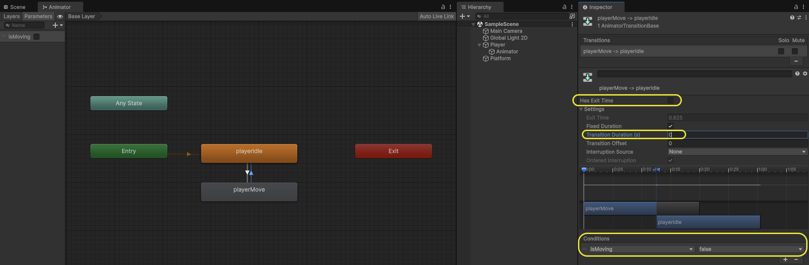
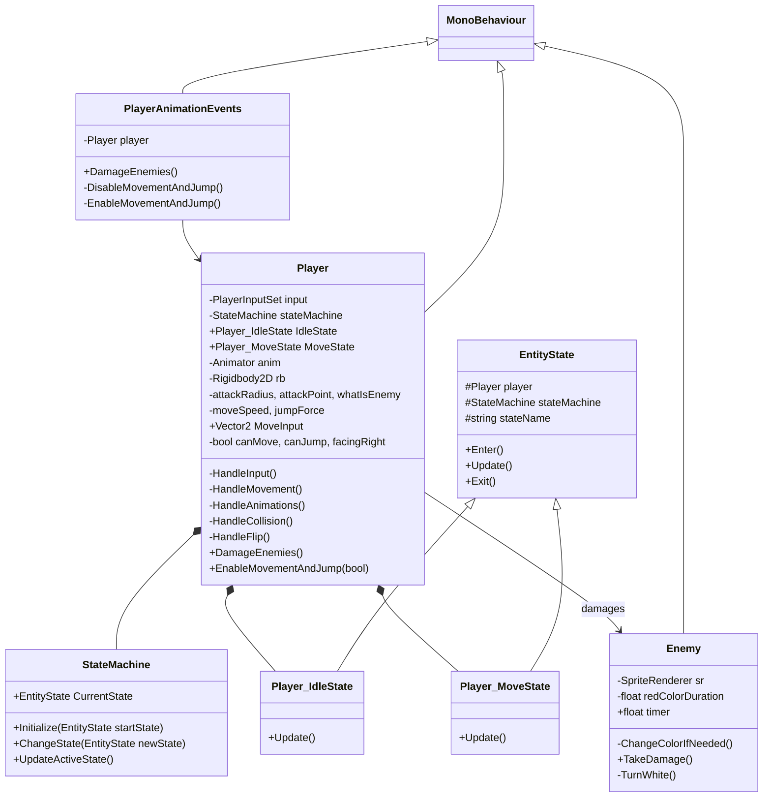

# Unity2DRPG
Unity 2D RPG (Role Playing) Game.


# Environment Setup

Unity version: **6000.1.2f1** - May 6, 2025  

https://unity.com/releases/editor/archive  


# VS Code Preferences

Enable Setting 'Format On Save' - The current file will be formatted when you press CMD+S.

Open Settings, search for "exclude", under "Files: Exclude", click on **Add Pattern**. Type
`**/bin` and click **OK**. And do the same for `**/obj`. This will hide these folders from the
Solution Explorer, since we won't interact with them very often.

Within Settings, search for "bracket" and make sure these two settings are Enabled:
- Auto Closing Brackets - Always
- Bracket Pair Colorization: Enabled - Checked
- Bracket Pair Colorization: Independent Color Pool Per Bracket Type - Unchecked
- Guides: Bracket Pairs - True

Open the **Command Palette** with: `SHIFT + CMD + P` (MacOS).

Open the editor's **More Actions...** contextual menu with `CMD + .` (MacOS); this will provide 
you with helpful quick actions like "Remove unnecessary usings", or "Generate constructor".

Open the **Keyboard Shortcuts** window under Settings, then click on the small icon in the
top-right corner with tooltip "Open Keyboard Shortcuts (JSON)" (the icon looks like a piece
of paper with a folded corner, and a circular arrow on the left). In the `keybindings.json`
file, add this entry:

```json
{
    "key": "shift shift",
    "command": "workbench.action.quickOpen"
}
```

Save the `keybindings.json` file and then close it. Now, when you double-tap SHIFT, it will open
up a sort of "Global Object Search" form field, and you can type the name of an entity, like
our `AppUser.cs`, and then press RETURN to open the file. Super-handy to have!

More details:
https://stackoverflow.com/questions/29613191/intellij-shift-shift-shortcut-in-visual-studio-global-search  

Under **Settings > CodeLens**, turn off "Show Main Code Lens". It adds extraneous noise to every 
method signature in the editor UI, with a bunch of "N references" indicators everywhere.


# Unity Tips & Tricks

## General
* Unity 6 Engine Lifecycle Execution Order: https://docs.unity3d.com/6000.0/Documentation/Manual/execution-order.html
* The Unity documentation can be found [here](https://docs.unity3d.com/Manual/index.html) 
  and the scripting reference can be found [here](https://docs.unity3d.com/ScriptReference/index.html)
* You can modify the template used by Unity when creating new scripts by editing 
  `Unity\Editor\Data\Resources\ScriptTemplates\81-C# Script-NewBehaviourScript.cs.txt`. 
  You can add a header, tidy up the using statements, setup tabs to your liking, add regions etc.
* When creating a new Unity project make sure to select `2D` or `3D` depending on what 
  type of project you are working on
* C# is probably the best choice of language for Unity. The vast majority of resources 
  available use C# e.g. documentation, tutorials, YouTube videos

## User Interface
* To reset all the editor views back to default you can click `Window -> Layouts -> Default`
* You can drag windows to different locations by left clicking and holding the title bar 
  and dragging it to where you want it
* When playing the game in Unity any changes you make in the editor will not be persisted. 
  To make that obvious you can change the UI tint used when playing with `Edit -> Preferences -> Colors -> Playmode tint`
* The five buttons on the top left of the main window are (with keyboard shortcuts):
  * Pan scene (`Q`)
  * Move objects (`W`)
  * Rotate objects (`E`)
  * Scale objects (`R`)
  * Rect tool used for UI tranforms (`T`)
* The five buttons on the top left of the `Scene` window are:
  * Render mode
  * 3D or 2D mode
  * Lighting on or off
  * Audio on or off
  * Effects on or off
* In 3D mode you can use the `mouse wheel` to zoom in and out, hold the `middle mouse button` 
  to pan and hold the `right mouse button` to look around. In 2D mode it is the same except 
  `right mouse button` also pans
* To zoom in/out on a specific object, double click it in the `Hierarchy` window
* You can drag and drop files in to Unity
* Get a larger view when playing the game in Unity by clicking the `Game` window 
  and enabling `Maximize On Play`
* You can use the mouse to increase and decrease numeric values in the `Inspector` 
  window by holding down the left mouse button on the label and moving the mouse
* You can see how your game will look in different resolutions by clicking the second 
  dropdown on the top of the `Game` window and selecting a resolution

## Keyboard Shortcuts
* Other useful keyboard shortcuts are:
  * `Ctrl + P` to play or stop

## Engine
* Some of the more important event functions are (full details can be found [here](https://docs.unity3d.com/Manual/ExecutionOrder.html)):
  * `Awake` is called on each object when the scene starts and before any Start functions are called
  * `Start` is called once only on each object before the first frame update
  * `Update` is called on each object every frame
* You can change the background color when playing by selecting the camera and changing 
  the `Background` property in the `Inspector` window

## Git
* To turn off the `LF will be replaced by CRLF` warnings in Windows execute the following 
  in a command prompt: `git config --global core.safecrlf false`

## Prefabs
* You can use prefabs to make it easier to work with multiples of the same object that share some or all of the same properties
* To do this you must first have the base object in the scene, so either create it as required or drag it from the `Assets` window
* Drag the object from the `Hierarchy` window to a `Prefabs` folder in the `Assets` window
* It will turn a blue color in the `Hierarchy` window to indicate it is a prefab
* You can now delete it from the `Hierarchy` window if needed
* Click the prefab in the `Assets` window and make whatever changes you need e.g. rename it, set some base properties
* Now drag the prefab as many times as you need in to the scene
* Any settings that differ for the object in the scene from the prefab will be shown in bold in the `Inspector` window
* You can revert an object in the scene back to the prefab defaults by clicking `Prefab -> Revert` in the `Inspector` window


# Screenshots

| Sprite Sheet Editor - Grid By Cell Size |
| :---: |
|  |

| Animator UI - Exit Time & Transition |
| :---: |
|  |


# Diagrams

## Class Hierarchy for Bravery RPG


